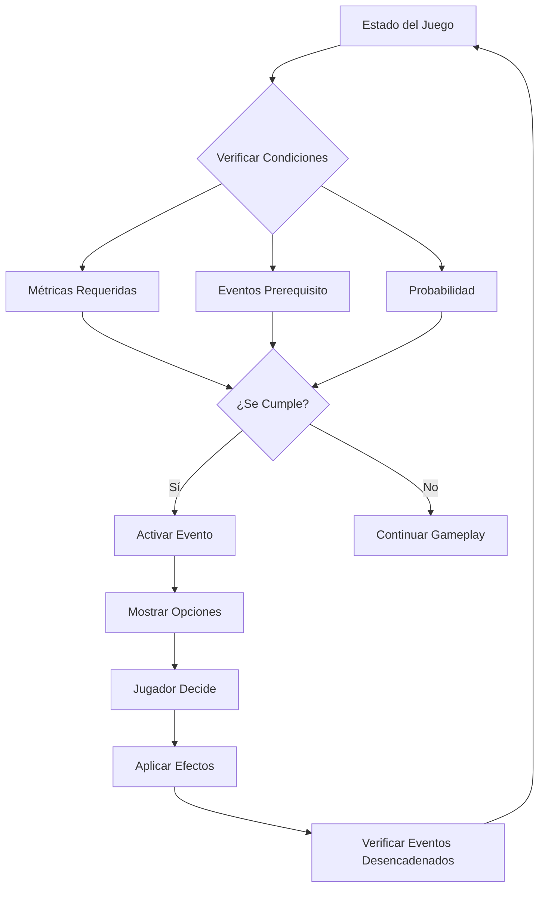

# 🎮 Guía Completa del Sistema de Eventos - Presidencial Bardo

## 📋 Índice
1. [Resumen del Sistema](#resumen-del-sistema)
2. [Flujo de Decisiones](#flujo-de-decisiones)
3. [Cadenas de Eventos](#cadenas-de-eventos)
4. [Impacto en el Gameplay](#impacto-en-el-gameplay)
5. [Estrategias Avanzadas](#estrategias-avanzadas)
6. [Análisis de Personajes](#análisis-de-personajes)

---

## 🎯 Resumen del Sistema

### Arquitectura de Eventos
El sistema de eventos políticos de **Presidencial Bardo** está diseñado como una red compleja donde cada decisión tiene consecuencias múltiples y a largo plazo.

**Estructura Base:**
- **33+ Eventos únicos** con humor argentino
- **120+ Decisiones posibles** distribuidas
- **4 Cadenas narrativas** principales
- **6 Métricas políticas** que se afectan
- **9 Facciones** con intereses específicos
- **24 Provincias** con características únicas

### Tipos de Eventos

#### 🔴 **Crisis** (Urgencia 4-5)
- **Características**: Requieren decisión inmediata, alto impacto
- **Ejemplos**: Crisis del Dólar, Escasez de Carne, Paro de Camioneros
- **Gameplay**: Aparecen cuando las métricas están bajas
- **Consecuencias**: Pueden desencadenar cadenas de eventos negativos

#### 🟢 **Oportunidades** (Urgencia 1-3)
- **Características**: Pueden mejorar la situación, opcionales
- **Ejemplos**: Festival de Cine, Visita Diplomática
- **Gameplay**: Aparecen con métricas estables
- **Consecuencias**: Mejoras graduales o beneficios a largo plazo

#### 🔵 **Decisiones** (Urgencia 2-4)
- **Características**: Definen el rumbo político, neutras
- **Ejemplos**: Superclásico Presidencial, Reunión con Barras
- **Gameplay**: Aparecen regularmente, independiente de métricas
- **Consecuencias**: Moldean las relaciones con facciones

#### 🟠 **Emergencias** (Urgencia 5)
- **Características**: Eventos críticos, tiempo limitado
- **Ejemplos**: Hiperinflación, Guerra de Barras
- **Gameplay**: Solo aparecen tras decisiones específicas
- **Consecuencias**: Cambios drásticos en todas las métricas

---

## 🔄 Flujo de Decisiones

### Activación de Eventos



### Ejemplo Práctico: Crisis del Dólar

**Condiciones de Activación:**
- Economía ≤ 40
- Probabilidad: 70%
- No en cooldown

**Opciones Disponibles:**
1. **Culpar especuladores** → Narrativa política (+10 Control Medios, -5 Popularidad)
2. **Emitir dinero** → Solución populista (+8 Popularidad, -15 Economía, desencadena "Hiperinflación")
3. **Crear dólar patriota** → Creatividad argentina (+15 Popularidad, +20 Corrupción, desencadena "Guerra de Dólares")

**Impacto en Gameplay:**
- **Decisión 1**: Evento aislado, efectos menores
- **Decisión 2**: Inicia cadena catastrófica → Hiperinflación → Plan Austral 2.0
- **Decisión 3**: Inicia cadena de confusión → Guerra de Dólares → Mercado Negro

---

## 🔗 Cadenas de Eventos

### 💸 Cadena del Dólar (Complejidad: ⭐⭐⭐⭐⭐)

#### **Evento Inicial: Dólar Sube Loco**
**Trigger**: Economía ≤ 40, Probabilidad 70%

**Rama A - Hiperinflación:**
```
Dólar Sube Loco → Emitir dinero → Hiperinflación Desatada
                                 ↓
                    Plan Austral 2.0 / Dolarización / Culpar a Macri
```

**Rama B - Guerra Cambiaria:**
```
Dólar Sube Loco → Crear dólar patriota → Guerra de Dólares
                                        ↓
                              Unificar / Crear más dólares
                                        ↓
                                 Mercado Negro
```

**Efectos en Gameplay:**
- **Rama A**: Colapso económico pero posible recuperación
- **Rama B**: Caos permanente pero más oportunidades de corrupción
- **Duración**: 3-5 eventos consecutivos
- **Impacto**: Toda la economía del país

### 🚧 Cadena de Piquetes (Complejidad: ⭐⭐⭐⭐)

#### **Evento Inicial: Piquete Masivo Nacional**
**Trigger**: Popularidad ≤ 30 Y Economía ≤ 35, Probabilidad 80%

**Desarrollo:**
```
Piquete Masivo → Negociar planes → Dependencia Planes Sociales
              ↓                   ↓
         Reprimir/Ignorar    Crear más planes / Reducir planes
              ↓                   ↓
    Escalada Violencia       Colapso Sistema / Revuelta Planeros
```

**Efectos en Gameplay:**
- **Negociar**: Paz temporal, dependencia a largo plazo
- **Reprimir**: Violencia inmediata, pérdida de legitimidad
- **Ignorar**: Deterioro gradual de todas las métricas
- **Duración**: 2-4 eventos
- **Impacto**: Estabilidad social y gasto público

### ⚽ Cadena del Fútbol (Complejidad: ⭐⭐⭐)

#### **Evento Inicial: Crisis del Fútbol Argentino**
**Trigger**: Popularidad ≤ 50, Probabilidad 40%

**Desarrollo:**
```
Crisis Fútbol → Salvar con fondos públicos → Fútbol Estatal
             ↓                            ↓
         Privatizar                 Politizar / Mantener autonomía
             ↓                            ↓
    Guerra Barras-Estado          Control mediático / Gasto continuo
```

**Efectos en Gameplay:**
- **Salvar**: Popularidad alta, control de barras bravas
- **Privatizar**: Eficiencia económica, enemigos poderosos
- **Duración**: 2-3 eventos
- **Impacto**: Relación con facciones deportivas

### 🏴 Cadena Provincial (Complejidad: ⭐⭐⭐⭐⭐)

#### **Evento Inicial: Rebelión Provincial**
**Trigger**: Popularidad ≤ 40, Probabilidad 30%

**Desarrollo:**
```
Rebelión Provincial → Negociar coparticipación → Efecto Dominó
                   ↓                          ↓
              Intervenir                Federalizar / Resistir
                   ↓                          ↓
           Guerra Civil              Argentina Confederada / Caos Federal
```

**Efectos en Gameplay:**
- **Negociar**: Precedente peligroso, más demandas
- **Intervenir**: Autoritarismo, crisis institucional
- **Duración**: 2-4 eventos
- **Impacto**: Estructura federal del país

---

## 🎮 Impacto en el Gameplay

### Sistema de Métricas

#### **📊 Popularidad (0-100)**
- **Función**: Determina reelección y estabilidad
- **Eventos que la afectan**: Sociales, económicos, deportivos
- **Crítica (≤25)**: Más eventos de crisis, riesgo de golpe
- **Alta (≥75)**: Eventos de oportunidad, mayor estabilidad

#### **💰 Economía (0-100)**
- **Función**: Recursos disponibles, bienestar general
- **Eventos que la afectan**: Económicos, laborales
- **Crítica (≤25)**: Eventos en cadena, escasez, inflación
- **Alta (≥75)**: Inversiones, crecimiento, estabilidad

#### **🛡️ Seguridad (0-100)**
- **Función**: Control del orden público
- **Eventos que la afectan**: Represión, negociación, violencia
- **Crítica (≤25)**: Caos social, pérdida de control
- **Alta (≥75)**: Autoridad respetada, menos conflictos

#### **🌍 Relaciones Internacionales (0-100)**
- **Función**: Comercio, diplomacia, imagen mundial
- **Eventos que la afectan**: Decisiones internacionales, crisis
- **Crítica (≤25)**: Aislamiento, sanciones
- **Alta (≥75)**: Cooperación, inversión extranjera

#### **🕵️ Corrupción (0-100)**
- **Función**: Transparencia (inversa), oportunidades ilegales
- **Eventos que la afectan**: Escándalos, controles, regulaciones
- **Baja (≤25)**: Gobierno transparente, menos recursos
- **Alta (≥75)**: Más recursos, pero más escándalos

#### **📺 Control de Medios (0-100)**
- **Función**: Narrativa política, influencia en opinión
- **Eventos que la afectan**: Decisiones mediáticas, escándalos
- **Bajo (≤25)**: Medios hostiles, narrativa opositora
- **Alto (≥75)**: Control de información, mejor imagen

### Efectos Graduales vs Inmediatos

#### **⚡ Efectos Inmediatos**
- **Duración**: Aplicados instantáneamente
- **Uso**: Crisis, decisiones dramáticas
- **Ejemplo**: Reprimir piquete → -20 Seguridad inmediato

#### **⏳ Efectos Graduales**
- **Lentos**: 45 segundos (cambios estructurales)
- **Medios**: 20 segundos (políticas públicas)
- **Rápidos**: 8 segundos (reacciones inmediatas)
- **Uso**: Reformas, cambios de largo plazo
- **Ejemplo**: Plan económico → +15 Economía en 45 segundos

### Sistema de Facciones

#### **👥 La Cámpora**
- **Intereses**: Poder político, narrativa kirchnerista
- **Eventos clave**: Medios, corrupción, populismo
- **Aliado**: +30 apoyo → Protección mediática, fondos
- **Enemigo**: -30 apoyo → Sabotaje interno, filtración

#### **💼 Empresarios**
- **Intereses**: Estabilidad económica, menos regulación
- **Eventos clave**: Economía, privatizaciones
- **Aliado**: +30 apoyo → Inversión, crecimiento
- **Enemigo**: -30 apoyo → Fuga de capitales, desabastecimiento

#### **⚔️ Barras Bravas**
- **Intereses**: Subsidios, control territorial, fútbol
- **Eventos clave**: Deportivos, seguridad, corrupción
- **Aliado**: +30 apoyo → Control de calles, popularidad
- **Enemigo**: -30 apoyo → Violencia, caos urbano

#### **🔧 Sindicalistas**
- **Intereses**: Derechos laborales, negociación colectiva
- **Eventos clave**: Paros, salarios, planes sociales
- **Aliado**: +30 apoyo → Paz laboral, movilización
- **Enemigo**: -30 apoyo → Paros generales, sabotaje

#### **📺 Medios**
- **Intereses**: Libertad de prensa, información
- **Eventos clave**: Censura, escándalos, narrativa
- **Aliado**: +30 apoyo → Cobertura favorable
- **Enemigo**: -30 apoyo → Investigaciones, exposición

---

## 🎯 Estrategias Avanzadas

### Gestión de Crisis

#### **🔥 Estrategia "Bombero"**
- **Objetivo**: Apagar crisis inmediatas
- **Método**: Priorizar efectos inmediatos sobre graduales
- **Riesgo**: Soluciones temporales, problemas recurrentes
- **Ideal para**: Jugadores nuevos, situaciones desesperadas

#### **🏗️ Estrategia "Arquitecto"**
- **Objetivo**: Construir estabilidad a largo plazo
- **Método**: Aceptar crisis menores por beneficios futuros
- **Riesgo**: Inestabilidad temporal, pérdida de popularidad
- **Ideal para**: Jugadores experimentados, partidas largas

#### **🎭 Estrategia "Populista"**
- **Objetivo**: Mantener popularidad alta
- **Método**: Decisiones que agraden al pueblo
- **Riesgo**: Insostenibilidad económica, dependencia
- **Ideal para**: Enfoque en reelección, gameplay agresivo

#### **🏛️ Estrategia "Institucionalista"**
- **Objetivo**: Fortalecer las instituciones
- **Método**: Decisiones transparentes y legales
- **Riesgo**: Lentitud, pérdida de oportunidades
- **Ideal para**: Gameplay defensivo, largo plazo

### Manejo de Facciones

#### **⚖️ Equilibrio de Poder**
```
Objetivo: Mantener todas las facciones en 40-60% apoyo
Beneficio: Estabilidad, menos eventos extremos
Dificultad: Requiere decisiones muy calculadas
```

#### **🤝 Alianzas Estratégicas**
```
Objetivo: 2-3 facciones aliadas (>70% apoyo)
Beneficio: Apoyo sólido, recursos garantizados
Riesgo: Enemigos poderosos, eventos hostiles
```

#### **⚔️ Confrontación Total**
```
Objetivo: Destruir facciones enemigas (<20% apoyo)
Beneficio: Eliminación de oposición
Riesgo: Caos, violencia, inestabilidad extrema
```

### Optimización de Cadenas

#### **💸 Cadena del Dólar - Optimización**
1. **Prevención**: Mantener Economía >40
2. **Si ocurre**: Elegir "Culpar especuladores" (menor impacto)
3. **Si falla**: Prepararse para hiperinflación con reservas

#### **🚧 Cadena de Piquetes - Optimización**
1. **Prevención**: Popularidad >30, programas sociales preventivos
2. **Si ocurre**: Negociar (control de daños)
3. **Seguimiento**: Gestionar dependencia gradualmente

#### **⚽ Cadena del Fútbol - Optimización**
1. **Prevención**: Mantener buenas relaciones con Barras Bravas
2. **Si ocurre**: Salvar fútbol (popularidad) o privatizar (economía)
3. **Aprovechamiento**: Usar fútbol como herramienta política

---

## 👤 Análisis de Personajes

### 📱 Gaspar "El Streamer"

#### **Fortalezas Iniciales**
- **Popularidad Alta (75)**: Resistencia a eventos sociales
- **Control Medios (40)**: Narrativa favorable inicial
- **Conexión Joven**: Eventos de redes sociales menos dañinos

#### **Debilidades Críticas**
- **Economía Baja (35)**: Vulnerable a cadena del dólar
- **Corrupción Alta (65)**: Más escándalos, menos transparencia
- **Falta Experiencia**: Eventos complejos más difíciles

#### **Estrategia Recomendada**
1. **Prioridad**: Estabilizar economía inmediatamente
2. **Aprovechar**: Popularidad para reformas impopulares
3. **Evitar**: Eventos de corrupción, mantener imagen limpia
4. **Facciones**: Alianza con Sindicalistas, neutralizar Medios

#### **Eventos Clave para Gaspar**
- **Favorables**: Invasión Carpinchos, Festival Cine
- **Peligrosos**: Crisis Dólar, Escándalo Funcionario Lujo
- **Críticos**: Cualquier evento de corrupción

### 💙 Benito Paz "El Corazón"

#### **Fortalezas Iniciales**
- **Popularidad Máxima (80)**: Resistencia extrema a crisis
- **Relaciones Internacionales (65)**: Imagen mundial positiva
- **Corrupción Baja (25)**: Menos escándalos, más transparencia

#### **Debilidades Críticas**
- **Seguridad Media (45)**: Vulnerable a violencia
- **Falta Autoridad**: Dificultad con represión

#### **Estrategia Recomendada**
1. **Aprovechar**: Popularidad para reformas difíciles
2. **Compensar**: Seguridad con alianzas (Militares, Barras)
3. **Mantener**: Imagen internacional, transparencia
4. **Evitar**: Decisiones violentas, autoritarias

#### **Eventos Clave para Benito**
- **Favorables**: Todos los eventos sociales, crisis humanitarias
- **Peligrosos**: Guerra de Barras, Represión
- **Críticos**: Cualquier evento que requiera violencia

### 🪦 La Señora K "La Medium"

#### **Fortalezas Iniciales**
- **Control Medios Máximo (70)**: Narrativa completamente controlada
- **Popularidad Alta (65)**: Base sólida de apoyo
- **Corrupción Baja (25)**: Transparencia "espiritual"

#### **Debilidades Críticas**
- **Dependencia Narrativa**: Vulnerable si pierde control medios
- **Misticismo**: Algunos eventos pueden ser contraproducentes

#### **Estrategia Recomendada**
1. **Mantener**: Control absoluto de medios
2. **Aprovechar**: Narrativa espiritual para legitimidad
3. **Expandir**: Popularidad en provincias conservadoras
4. **Facciones**: Alianza fuerte con La Cámpora

#### **Eventos Clave para La Señora K**
- **Favorables**: Eventos culturales, espirituales
- **Peligrosos**: Crisis de credibilidad, eventos racionales
- **Críticos**: Pérdida de control mediático

### 🎤 La Chola Arias "La Cumbiambera"

#### **Fortalezas Iniciales**
- **Relaciones Internacionales (70)**: Imagen cultural positiva
- **Popularidad Alta (70)**: Especialmente en el norte
- **Control Medios (55)**: Presencia mediática natural

#### **Debilidades Críticas**
- **Economía Baja (35)**: Vulnerable a crisis económicas
- **Concentración Regional**: Débil en grandes centros urbanos

#### **Estrategia Recomendada**
1. **Aprovechar**: Imagen internacional para inversiones
2. **Expandir**: Popularidad desde el norte hacia el centro
3. **Estabilizar**: Economía con ayuda internacional
4. **Mantener**: Autenticidad cultural

#### **Eventos Clave para La Chola**
- **Favorables**: Festival Cine, eventos culturales, internacionales
- **Peligrosos**: Crisis económicas urbanas
- **Críticos**: Pérdida de autenticidad, gentrificación

### ⚽ Chiquito Tapón "El Barra"

#### **Fortalezas Iniciales**
- **Seguridad Alta (70)**: Control de la calle
- **Popularidad Alta (70)**: Base leal y apasionada
- **Barras Bravas Aliadas (50% apoyo)**: Facción poderosa controlada

#### **Debilidades Críticas**
- **Corrupción Máxima (75)**: Vulnerable a escándalos
- **Relaciones Internacionales Bajas (40)**: Imagen negativa mundial
- **Empresarios Enemigos (-25% apoyo)**: Oposición económica

#### **Estrategia Recomendada**
1. **Aprovechar**: Control de seguridad para estabilidad
2. **Gestionar**: Corrupción cuidadosamente, evitar exposición
3. **Expandir**: Popularidad más allá del fútbol
4. **Neutralizar**: Oposición empresarial gradualmente

#### **Eventos Clave para Chiquito**
- **Favorables**: Todos los eventos deportivos, de seguridad
- **Peligrosos**: Escándalos de corrupción, eventos internacionales
- **Críticos**: Guerra con Barras Bravas, pérdida de control

---

## 🎯 Consejos Finales para el Gameplay

### Para Principiantes
1. **Enfócate en una métrica**: No trates de optimizar todo
2. **Lee las descripciones**: Cada evento tiene pistas sobre consecuencias
3. **Experimenta**: El juego está diseñado para múltiples partidas
4. **Usa el visualizador**: Estudia las conexiones entre eventos

### Para Jugadores Avanzados
1. **Planifica cadenas**: Anticipa eventos desencadenados
2. **Gestiona facciones**: El equilibrio de poder es clave
3. **Aprovecha la corrupción**: A veces es útil para recursos
4. **Piensa en provincias**: El federalismo importa

### Para Expertos
1. **Manipula probabilidades**: Controla cuándo aparecen eventos
2. **Optimiza timing**: Usa efectos graduales estratégicamente
3. **Crea sinergias**: Combina efectos de múltiples decisiones
4. **Domina las narrativas**: El control mediático es poder real

---

*"En Presidencial Bardo, como en la Argentina real, no hay decisiones perfectas. Solo hay decisiones argentinas."* 🇦🇷
